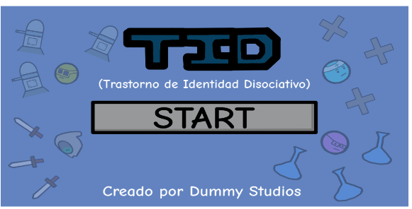
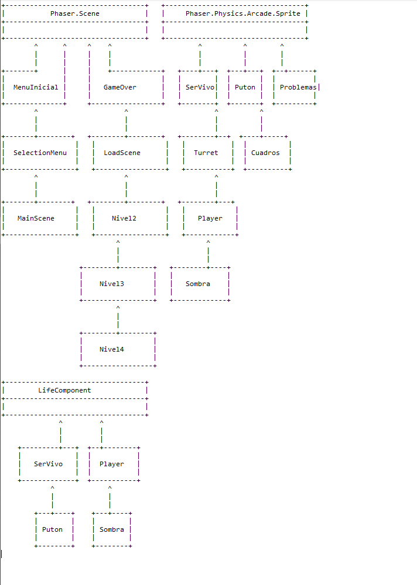

# PVLI-2023-24
Proyecto de PVLI curso 23/24 UCM.  

> Twitter: [https://www.twitter.com/StormSudio](https://twitter.com/DummyStudiosUCM)  
> Videojuego: [https://acedpol.github.io/PVLI-2022-23/  ](https://github.com/AlvaPina/PVLI---Grupo-4---23_24)

---  

## Idea principal
El juego, titulado "TID", sigue la historia de Will, un joven con trastornos mentales y personalidad múltiple. El jugador controla a Will, explorando mundos imaginarios basados en sus distintas personalidades, enfrentándose a enemigos cotidianos como problemas de matemáticas. A lo largo del juego, Will puede cambiar entre cuatro personalidades jugables, cada una con habilidades únicas, como el combate cuerpo a cuerpo, lanzamiento de pociones, o creación de torretas.

---  
---  

 #### Proyecto desarrollado por: _Dummy Studios (Grupo 04)_  
 
---  

 #### IMPORTANTE:  
 - En el fichero **_index.html_** se encuentra el punto de acceso que compone el acceso al videojuego.  
 - En el actual fichero **_readme_** se prensenta información relevante para su uso y sobre el desarrollo del juego.  
 - En la carpeta **_assets_** se encuentran los recursos de los dispone el videojuego.  
 
---  
---  

# GDD: Game Design Document  
> Documento de Diseño del Videojuego  
>> **TID - Un viaje a través de la mente.**  

### **Contribuidores:** GRUPO #04 - PVLI :  Dummy Studios  
- Luis Javier Navarrete Pulupa
- Álvaro Piña Sánchez-Sierra
- Jose E. Robles Roca
- David Palacios Daza 
---  

| **Detalles generales** |  |
| :--- | ---: |
| **Géneros** | Plataformas |
| **Modos** | Historia, single player. |
| **Público objetivo** | Todos los públicos |
| **Plataformas** | PC (Ordenadores con navegador Chrome, teclado y ratón) |

| **Cantidades** |  |
| :--- | ---: |
| **Escenarios** | 4 |
| **Objetos** | RedBull |
| **Armas** | Pociones, Torretas, Puños, Espada |
| **Personajes** | Will (player) |
| **Palabras** | 16 personalidades. |

| **Versiones del documento** | 2023 |
| :--- | ---: |
| **Fecha de propuesta del concepto** | 30 de septiembre |
| **Fechas de pre-producción** | 27 de octubre |
| **Fechas de producción** | 01 de diciembre |
| **Fecha de lanzamiento** | 20 de diciembre |

---  

## Índice  

[**I - Aspectos generales**][1]  

[**II - Jugabilidad**][2]  
1. Movimiento del personaje  
2. Cámara  
3. Mecánicas del jugador  
4. Mecánicas del escenario
   
[**III - HUD**][3]  
1.Explicación de los elementos del HUD y su funcionamiento
2.HUD Selección de personaje

[**IV - Visual**][4]  

[**V - Contenido**][5]  
1. Historia  
2. Niveles  
3. Personajes y enemigos  
4. Objetos  

[**VI - Arquitectura y gestión**][6]

[**VII - Referencias**][7]  

---  

## I - Aspectos generales  
Es un plataformas en las que iras viendo el proceso de fragmentarse la personalidad de alguien con tid 

[Go back to index -->][indice]  

---  

## II - Jugabilidad  

### 1. Mecánica
   #### 1. Movimiento del personaje:
    ● El jugador se puede mover lateralmente de izquierda a derecha con las teclas A y D respectivamente y podrá saltar pulsando la barra espaciadora o la tecla W.
	  
   #### 2. Cámara:
    ● La cámara poseerá un movimiento tipo Smooth que sigue al jugador a medida que este avanza. Se puede volver atrás si el jugador lo desea, y la cámara seguirá teniendo este tipo de movimiento.
   #### 3. Mecánicas del jugador:
    ● El jugador a lo largo del juego podrá cambiar entre 4 personalidades jugables: Lógica, Defensor, Virtuoso y Protagonista, pulsando la tecla control.
	● Cada una de estas personalidades jugables poseerá una ataque único que los distingue del resto
	
  | **Personalidad Jugable** |  Mecánicas | 
  | :--- | ---: |
  | **Protagonista** |Utiliza una espada con la que combate cuerpo a cuerpo con los enemigos (daño mayor) |
  | **Lógica** |Puede lanzar pociones con las que atacar a los enemigos desde lejos (daño menor)|
  | **Defensor** | Utiliza sus puños para combatir cuerpo a cuerpo |
  | **Virtuoso** | Crea torretas que disparan a los enemigos (Solo lanza 1 si hay una en el campo y si lanza otra la anterior se destruye). En el caso de que se cambie de personaje, la torreta se mantiene. |

   #### 4. Mecánicas del escenario
    ● En cuanto a mecánicas de escenario, los distintos niveles del juego van a poseer varias plataformas flotantes en las cuales el jugador se va a poder posar.
    ● Todos los niveles del juego están compuestos por enemigos que intentarán herir al jugador. Hay enemigos que pueden lanzar proyectiles y otros que intentan hacerte daño cuerpo a cuerpo. 

[Go back to index -->][indice]  

---  

## III - HUD
### 1.Explicación de los elementos del HUD y su funcionamiento
        ● El HUD InGame consta de un par de elementos muy sencillos en la esquina superior izquierda. Primero tenemos un icono que muestra el personaje que el jugador controla en ese momento y una barra de corazones que indican la cantidad de energía vital que le queda. 
 
 ### 2.HUD Selección de personaje       
        ● Si  pulsamos la tecla Control, podremos acceder al menú de selección de personalidad. En el momento que accedemos a este menú, nos encontramos con una rueda de selección. Los personajes que están en gris no se pueden seleccionar y se desbloquearán más tarde. Para seleccionar una personalidad, solo deberá clicar en el icono.

### 3. HUD de Inicio
        
        ● Este es el menú de inicio en el que podemos empezar a jugar dando al botón de Start.

### 4. HUD Gameover
        
        ● Este es el menú de inicio en el que podemos empezar a jugar dando al botón de Start.

[Go back to index -->][indice]  

---  

## IV - Visual

El estilo visual del juego es desenfadado, cartoon e inocente, donde los personajes son como una especie de marioneta o muñeco andante que carecen de extremidades. Además, todos los personajes parecen ser hechos con rotuladores en Paint.
La idea principal de diseño de cada nivel es en base a las distintas personalidades jugables que se van desbloqueando en los distintos niveles.

Diseño de nivel (Lógica):
Entorno: Una clase pensada para escapar hacia la libertad.
Enemigos: Variables matemáticas que cobran vida e intentan herir a nuestro personaje con ecuaciones matemáticas.

Diseño de nivel (Defensor):
Entorno: Una ciudad llena de peligros donde reina el crimen y los delitos. Una puerta escondida accesible a través de un balcón tras realizar un peligroso salto.
Enemigos: "Putones" enemigos que pueden distraer a nuestro personaje y que hieren a nuestro protagonista mediante abrazos.

Diseño de nivel (Virtuoso):
Entorno: Un lugar lleno de arte, los cuadros y pilares flotantes que formarán un camino mientras haces parkour.
Enemigos: “Cuadros” enemigos que vuelan y persiguen al jugador volando.

Diseño de nivel (Protagonista): 
Entorno: Un escenario con focos que le apuntan todo el rato con el fin de agobiar al protagonista. Es un mapa preparado para oleadas.
Enemigos: Sombras de conocidos de Will, como amigos y familiares, pero que intentan atrapar a nuestro personaje para llevarlo a la depresión mediante comentarios hirientes.

 
## V - Contenido
1. Historia  
2. Niveles  
3. Personajes y enemigos  
4. Objetos  

[Go back to index -->][indice]  

## VI - Contenido
7.1. Historia
Will es un niño normal con demasiada imaginación que en un momento bajo el estrés de bachillerato desarrolla múltiples personalidades, la primera que se manifiesta es la lógica, siendo sus enemigos los problemas de matemáticas, a medida que termina bachillerato “consigue” pareja (enemigos Putones) y desarrolla la personalidad de protección, cuando entra a la universidad se mete a una carrera de bellas artes y queriendo seguir a los grandes maestros desarrolla una personalidad virtuosa, que le permite encontrar caminos que antes no existían y por último cuando ya la gente a su alrededor se da cuenta de sus problemas desarrolla una personalidad de protagonista ya que todo el mundo intenta hablar con él para ayudarle, (a partir de aquí opcional depende de si nos da la vida), antes de que le intenten internar en un centro psiquiátrico donde las pastillas le quitan todo lo conseguido.(personalidades, pareja….).

7.2. Niveles
Tras el hito anterior, se ha decidido que el juego tendrá 3 4 niveles en los que cada uno tendrá una ambientación distinta basada en la personalidad protagonista de dicho nivel tal y como se explicó anteriormente.

7.3. Personajes y enemigos

  Personajes: 
  | **Nombre** |  Descripción | 
  | :--- | ---: |
  | **Protagonista** |Una personalidad que en su imaginación es un valeroso caballero espadachín que lucha contra las injusticias. Es experto en ataques a corta distancia. |
  | **Lógica** |Una personalidad que es un profesor de química y que utiliza sus pociones hechas a base de ácidos para herir a los enemigos. Es experto en ataques a larga distancia. Este personaje no tiene habilidades especiales.|
  | **Defensor** | Una personalidad que es un luchador experto en artes marciales y Es bueno en ataques cuerpo a cuerpo. |
  | **Virtuoso** | Una personalidad que es experto en la creación de torretas que disparan balas a distancia. |

  Enemigos:
    | **Nombre** |  Descripción | 
  | :--- | ---: |
  | **Ecuaciones** |Las variables, el mayor temor de Will (y de todos, para que engañarnos) en las Matemáticas, han cobrado vida e intentarán herir a nuestro protagonista a base de ataques matemáticos cuerpo a cuerpo. |
  | **Putones** |Por culpa de estos enemigos, la relación amorosa de nuestro protagonista correrá peligro.|
  | **Putones Pincho** | Los putones pincho están siempre a la espera de que algún pobre desesperado caiga en sus brazos. Provocan un Knockback. |
  | **Sombras** |Todas las personas queridas de nuestro protagonista están en su contra y tratarán de llevarlo a la más profunda oscuridad.
Son expertos en ataques a corta distancia y no pararán de seguir a nuestro protagonista |

7.4. Objetos
A lo largo de los niveles habrá objetos curativos esparcidos, llamados RedBull, que sirve para recuperar energía vital (si es necesario añadiremos más). Otorgarán 1 corazón de energía al jugador.

[Go back to index -->][indice] 

## VI - Referencias  

●   Género Plataformas 
●   Hollow Knight (Team Cherry, 2017)
●   Castlevania (Konami Corporation, 1986)
●   Super Mario Bros. 3. (1988). [Nintendo EAD]. Nintendo.

[Go back to index -->][indice]  

---
UML

---
ASSETS
Todos los assets han sido de creacion propia

---
## Para iniciar el servidor http  
Primero, iniciar Git Bash en la ruta del proyecto y luego ejecutar el comando: `npx http-server`  
Si no está instalado http-server, ejecutar: `npm install http-server`  
Si node.js no está instalado, descargar e instalar: https://nodejs.org/dist/v16.17.0/node-v16.17.0-x64.msi  
> Phaser docs: https://photonstorm.github.io/phaser3-docs/  

